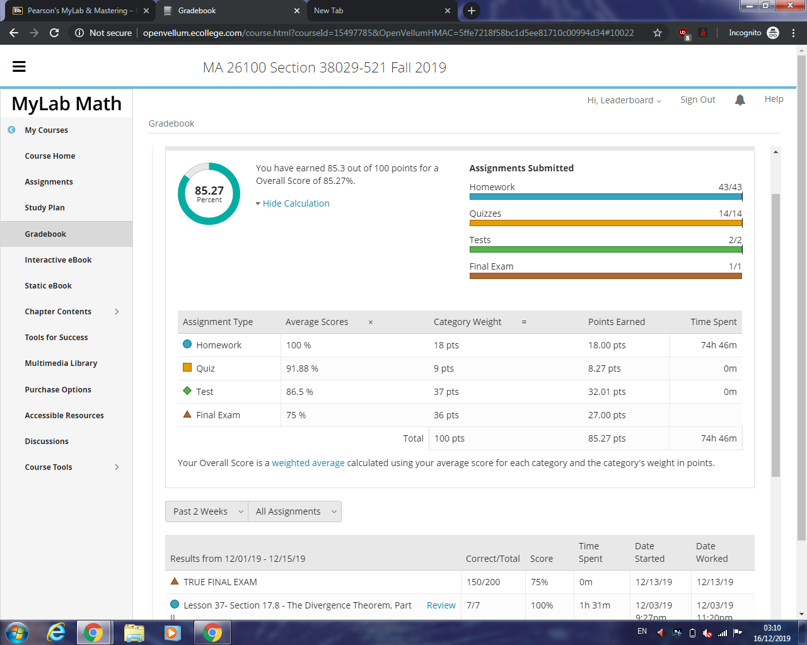

# Exam grading FAQ
There seems to be quite a bit of confusion on how the core Purdue calculus courses (Calc 1-3) are graded. Here I try to explain how exactly it works.
This is for Calculus 3 (MA261), but the ideas are the same for many others (like Calc 1/2).
## Step 1 - The exams
The process starts with the exams. In Calculus 3, there are two midterms (each out of 100) and a final (out of 200), for a total mark out of 400. This is the *only* metric used for the initial ranking process.
The instructors first determine the mark cutoff for each grade (eg: 335/400 for an A). Then, they rank all the people based on *only* their combined exam scores. For Calculus 3, out of the ~2400 students, roughly 20-23% people (around 500 - 550 students) will get an A - some of them with an A+, and some with an A-.
## Step 2 - The recitation
Now the grade cutoffs have been determined and a 'grade' has been attached to your name *just based on your exams*. Then your recitation instructor will look at their students, and take your exam-only grade, and add it into a 'basket'. 

As an example, for a recitation of 30 students, assume that 7 students have an A, 7 have a B, 7 have a C, 7 have a D and the remaining poor two students have an F. So the recitation 'basket' contains seven As, seven Bs, and so on.
## Step 3 - Getting your final grade

Now that the recitation 'basket' is done, then your quiz and homework scores are added, and then all students in that recitation will be re-ranked, this time with your **entire** score (out of 550). Then, he'll take the grades from the 'basket'. This means that while they (should!) love all of you and would like to give all their students As if they could, their 'basket' contains only a finite number of As (in this example 7) and hence can only give that many students that grade.
## How does that matter in my final grade?
It depends. Assuming a normal Gaussian distribution, it's unlikely (assuming that you've been doing your homework and have obtained a reasonable quiz score) that if you're doing well above average, that your grade will be impacted. This is because assuming a homework score of 100, the difference between your classmates' scores will be a few points at most. This goes the same way if you're well below average - doing well in quizzes will be unlikely to save you. 

**However**, if you're around the median, this could impact your grade, as many of you will be bunched around the C to B region. So considering that many of you will get similar total exam scores, the quiz and HW can make or break a +/-. It must be noted however that this can only happen if and only if you get *less* than 42/50 in the quiz assuming a perfect homework score (as that is the only way someone with a weaker exam score can overtake you). That is, it is safe to assume that if you have lost 8 or fewer marks in the combined HW and quiz score, then your grade will not be adversely affected.
### Example?
Sure. If two students (let's call them Student 1 and 2) have the same exam score of say 260/400 (which could be a C) and another with a score of 250/400 (which can be a C-). Now, let Student 1 and 3 have a quiz+HW score of 145/150, while Student 2 slacked off and got only 125/150. Then the recitation instructor adds up their scores. So,

Student 1's total score: 260 + 145 = 405/550  
Student 2's total score: 260 + 125 = 385/550  
Student 3's total score: 250 + 145 = 395/550

The recitation instructor now looks at their scores. He has two Cs and one C- to give out. Even though Student 3 did a bit poorer in the exams compared to Student 2, the fact that Student 3 did well on the homework and quizzes meant that he overall did better than Student 2, and hence gets the C. Student 2 is hence consigned to a C- (and rues themselves for not doing their homework).

## Part 2 - Getting your final grade

I've added this section in response to several queries on the GroupMe chat.  
First, go to MyMathLab and click Gradebook:

Then you can find your total score by multiplying the final 'points earned' score by 5.5. Doing that, we see that Leaderboard has (85.27) * 5.5 = 469.8 points. Will he get an A? Let's hope he does.

Below are my answers to some FAQs that I've seen:

### My "Final Score" is a 0, but my "True Final Score" is something else.

Don't worry. You haven't done the impossible and scored a zero. Your actual score is the one reported by "True Final Score".

### Quizzes 12 to 14 are zeros, despite my never taking them.

MyMathLab was originally set to have 14 quizzes (don't ask me why), but we only had 11. So what they did in essence is fill quizzes 12 to 14 with zeros, and then drop the lowest **6** quizzes, consuming the three zeros in the process. The three quizzes you didn't take are marked as (omitted), and the three quizzes that you score the lowest are marked as (dropped).

If that isn't the case (i.e, your three lowest actual quizzes haven't been dropped), talk to your TA.
### What's my actual HW score (/100) and quiz score (/50)?
Divide the points that you got in that section with the category weighing, and multiply by 100 or 50 as required. Or use the average scores category.

In Leaderboard's case, he got 18/18 (100/100) in the HW, and 8.27/9 (45.95/50) in the quiz.
### I got score X. What's my grade?

As said before, it depends on your recitation. However, thanks to a couple of TAs who have kindly provided their grading cutoffs, we can make a very good estimate on what grade you could get.

*Credits to Ray Wu and Jake T for kindly providing them from the GroupMe chat*

|Grade |Duo Cao | Junpyo Choi
|--|--|--|
| A+ | N/A |502
| A | 463 |470
| A- | 436 |439
| B+ | 413 |421
| B | 396 |397
| B- | 377 |379
| C+ | 361 |348
| C | 343 |N/A
| C- | 305 |310
| D+ | 278 |278
| D | 261 |263

Anyone below the minimum for a D gets a F.  
What does this mean?
* If you are in Duo Cao (not sure which section) or Choi's 10:30 am section, then you can determine your *actual* grade from that table.
* If you're in **any other** recitation, then you can use this table to make a very good guess on what your final grade would be. In our case, Leaderboard has a 470, so he can safely, but nervously, say that he has an A. It depends on how 'hard' your recitation was in terms of quizzes. Remember though (again) that your grade CANNOT be adversely affected if you have lost 8 or fewer points in the sum of HW and quiz scores.

### I'm only X points away from that cutoff. Will I get that higher grade?

Technically not, as they only have a finite number of each grade to give out from the 'basket'. That being said, TAs could willing to round up your score, and also probably raise your grade if you are that close (say 1 - 3 points). I can't tell what your result would be, but Leaderboard hopes that you do!

### I think I will get only a D+ or a D. Will I have to retake?

Technically it depends. Most people will have to unfortunately. That's because while technically 'sufficient' for the purposes of getting credit, you will not be able to take MA265 or MA266 or take anything else that has Calc 3 as a pre-requisite (like CS 381), as you need a C- in that case. This includes most Engineering and all CS students. If you're in FYE, this may also cause issues with satisfying your academic requirements.
